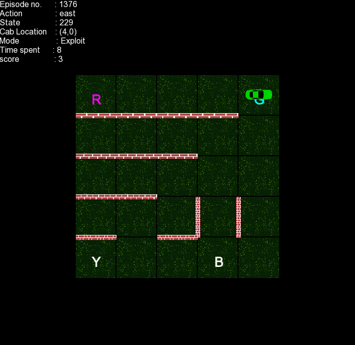
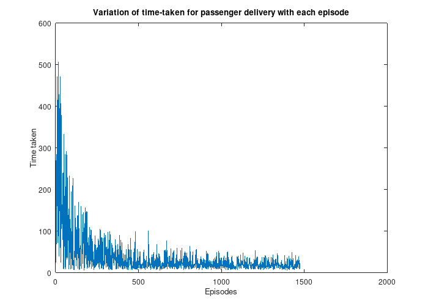
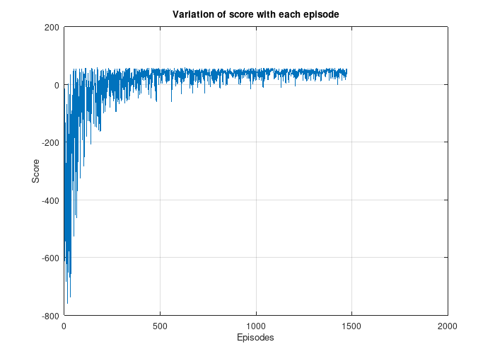

  

# ViSmartCab

This project is an attempt to implement OpenAI Taxi-v2 in C++. 

It uses a simple [Q-learning](https://en.wikipedia.org/wiki/Q-learning) ([RL](https://en.wikipedia.org/wiki/Reinforcement_learning)) model written from scratch in C++. For graphical output, SFML (Simple and Fast Multimedia Library) is used.

### Requirements

* C++ compiler
* [SFML library](https://www.sfml-dev.org/)

Edit the `Makefile`, if necessary, to match your specifications.

### Installation

Here are the instructions to build and run this app in any Linux system:
* Clone the repo: `git clone https://github.com/VivekThazhathattil/vismartcab`
* Navigate to the repo directory: `cd vismartcab`	
* Execute `make build` from the current directory. This will build the program.  Make sure you have SFML libraries in your system.

Run `make clean; make` to remove any previous sessions and to start a fresh new session.
You may also replace the file `saveData/qTable.dat` with similar file of the same name to resume training for that session.

### Features

* Press up arrow and down arrow to slow down/ speed up the simulation/training.
* Autosaves `Reward Table` so that it can be reused if a run is halted for some unforseen reason and the user wishes to continue training.
* Displays important information pertaining to the run alongside the graphical window.
* `saveData/stats.dat` stores the score and time-taken for all the episodes thus far.
* Configure your own walls easily using the function `addWall(orientation, length, origin_x, origin_y)` in `src/wall.cpp`. Specify `orientation` to be horizontal using 'h' or vertical using 'v', 1 unit of wall length being sidelength of the grid and `origin_x` and `origin_y` specifies the coordinates of the wall origin. Recompile after configuration to switch to use your wall setup.
* Left click on the grid edges to create walls. Right click anywhere inside the window to remove the most recently added wall.

### Issues

Any issues pertaining to the program may be reported via [GitHub Issues](https://github.com/VivekThazhathattil/ViSmartCab/issues). You may also contact me at vivek.thazhathattil@gmail.com for help/feedback.
